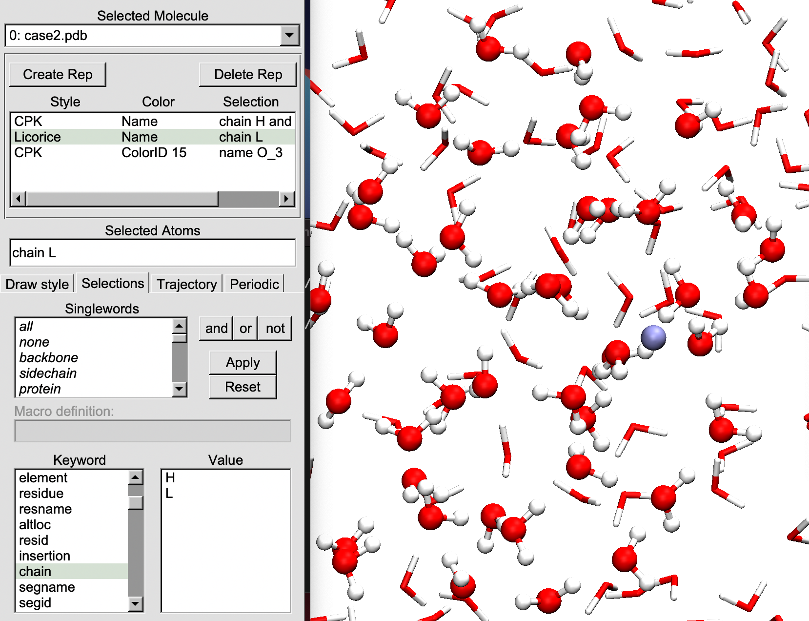

# Visualizing Gaussian ONIOM inputs with VMD

This python script converts Gaussian `*.com` or `*.gjf` inputs to a PDB file. All ONIOM and frozen layer details are added to the PDB `chain` and `segid` columns. This can be later used to create atom selections in VMD. 

## Installation
Download all files manually or clone the repository using:
```bash
git clone git@github.com:madhurangar/oniom-vmd-visualisation.git
``` 

## Usage
Execute the python script with correct system arguments:
```bash
python3 path/to/gau2pdb.py input.gjf output.pdb
```

for help and to see commandline options, try `python3 path/to/gau2pdb.py -h` 

## Example


All files are tutorial located at `tests` folder. First, do the file conversion.
```bash
python3 ../gau2pdb.py case2.gjf case2.pdb
```

Then open the PDB in VMD (`vmd case2.pdb`) and carry out the visualisation. Now you can see all ONIOM and frozen layer information in atom selection options. 

```tcl
# file: vmd-styles.tcl
display nearclip set 0.010000
display projection Orthographic
color Display Background white
display depthcue off
color Axes Labels black

mol modselect 0 0 chain H
mol modstyle 0 0 CPK 1.000000 0.400000 120.000000 12.000000
mol modmaterial 0 0 AOEdgy

mol color Name
mol representation Licorice 0.100000 120.000000 12.000000
mol selection chain L
mol material AOEdgy
mol addrep 0
```

Finally, render your visualisation. 
```tcl
render Tachyon vmdscene.dat "path/to/vmd" -aasamples 12 %s -format TARGA -res 1024 1024 -o %s.tga
```

Enjoy! 